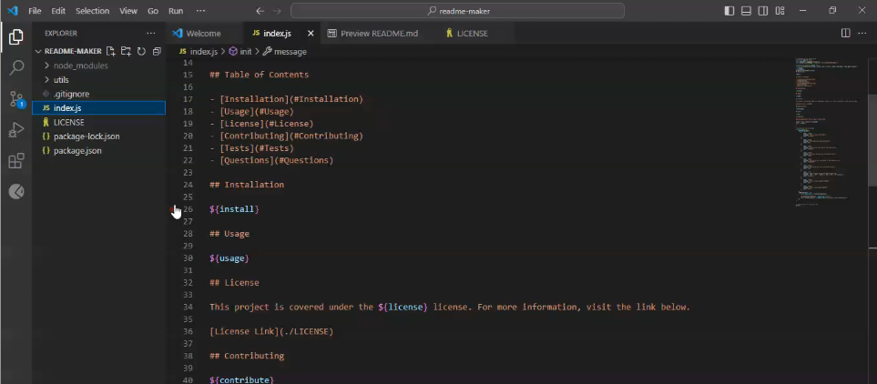

# README maker

## Description

This is an app that automatically creates a professional README using the terminal and Node.js. I created this application so that I can make a professional README in a much simpler manner than before. 
    
## Table of Contents

- [Installation](#Installation)
- [Usage](#Usage)
- [License](#License)
- [Questions](#Questions)
    
## Installation

The user can install this application by downloading and/or cloning the contents from this repo.

## Usage
    
The user can use this application by navigating to the folder where index.js is located using the terminal. Then, type node index.js (or node index).

## License

This project is covered under the MIT license. For more information, visit the link below.

[License Link](./LICENSE)
    
## Questions

Have any questions? This is how to contact me:

Github: https://github.com/RuckusEnjoyer
